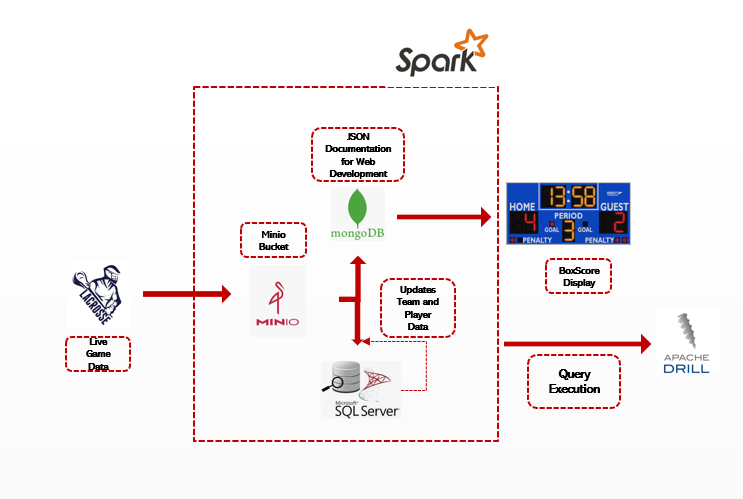

# LiveSportsStream_DataPipeline

## Introduction
This datapipeline focuses on processing a Lacrosse game’s live data, that creates box score and updates the database tables when game is over.

## Data Pipeline: 

## Services Used: 
### Databases: 

• **mssql** : Microsoft SQL Server Database that stores player and teams reference data. The database is called ‘sidearm’ and the tables are ‘players’ and ‘teams’.

• **minio**: An S3 compatible object store that contains the live gamestream data. It is stored in minio/gamestreams bucket.

• **mongodb** – A mongodb database that stores the game streams real-time box store so the web developers can create a page from the data. The box score is written to mongo/sidearm/boxscores collection.

## Analytical Tools: 

•	**drill** - An instance of Apache Drill that can be used to query the databases. The drill-storage-plugins folder contains the configuration files for the databases. You will need to modify these with specifics for them to work.

•	**jupyter** - An instance of Jupyter Lab that can be used to write PySpark code. The work folder contains the Start.ipynb that demonstrates the base spark configuration.

## The Problem:
The objective is to create a data pipeline which processes a simplified version of an in-game stream from a simulated a lacrosse game. The game stream has been simplified to only process goals scored. There are two parts to this problem:

1.	At any point while the game is in progress, the game stream should be converted into a JSON format so the web developers can use it to create a box score page on a website. This JSON should be written to the mongodb/sidearm/boxscores collection, and should contain all the data necessary to display the box score page
  
2.	When the game is over, the player and team reference data should be updated to reflect the team records and player statistics after the competition has ended. Normally you would update the mssql tables, but for this exam you will create new tables with the updated data, players2 and teams2 respectively. This is mostly because spark does not support row-level updates. In a real world scenario, you would write an SQL script on mssql to update the tables. from the changes in the players2 and teams2 tables, but that is outside the scope of this exam.
